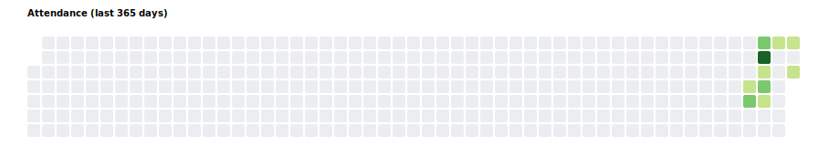

# 朝活

コミットで日々の参加状況を記録・可視化します。
ワークフローが履歴を集計して README の SVG を更新します。

## 可視化

参加ヒートマップ (AIの雑実装なので、3人以上は色が変わらない)



## 記録の付け方

```bash
bin/check-in -m "ひとこと"
```

記録し忘れた場合
```bash
bin/check-in -d 2025-08-13 -m "忘れてた"
```
